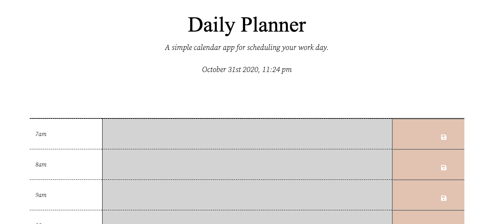

# Daily_Planner

## Description

https://rafaelrosas19.github.io/Daily_Planner/
The goal of this web page was to create a daily workday planner that allows you to keep of track of tasks throughout the day. At each hour there is a text box that can be filled with information. The button on the right allows you to save your inputs in local storage in order to reference them later with color codes. 

## Installation 

To install the repository just follow your basic ssh clone procudure and use whichever text editor you like. It is completely up to you!

## Credits

My project teamates.

## License MIT License

Copyright (c) [2020] [Rafael Rosas]

Permission is hereby granted, free of charge, to any person obtaining a copy of this software and associated documentation files (the "Software"), to deal in the Software without restriction, including without limitation the rights to use, copy, modify, merge, publish, distribute, sublicense, and/or sell copies of the Software, and to permit persons to whom the Software is furnished to do so, subject to the following conditions:

The above copyright notice and this permission notice shall be included in all copies or substantial portions of the Software.

THE SOFTWARE IS PROVIDED "AS IS", WITHOUT WARRANTY OF ANY KIND, EXPRESS OR IMPLIED, INCLUDING BUT NOT LIMITED TO THE WARRANTIES OF MERCHANTABILITY, FITNESS FOR A PARTICULAR PURPOSE AND NONINFRINGEMENT. IN NO EVENT SHALL THE AUTHORS OR COPYRIGHT HOLDERS BE LIABLE FOR ANY CLAIM, DAMAGES OR OTHER LIABILITY, WHETHER IN AN ACTION OF CONTRACT, TORT OR OTHERWISE, ARISING FROM, OUT OF OR IN CONNECTION WITH THE SOFTWARE OR THE USE OR OTHER DEALINGS IN THE SOFTWARE.
